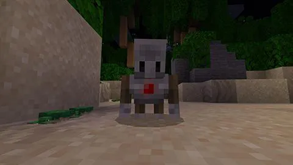
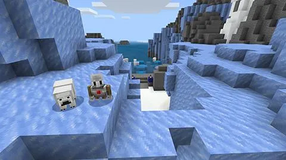
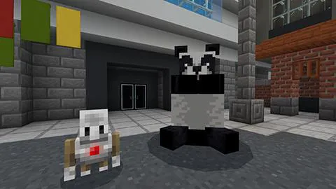
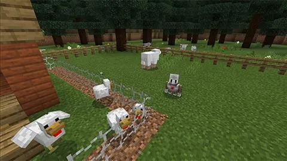

# 動物(どうぶつ)保護(ほご)

- 01-01：基本(きほん)動作(どうさ)

    

- 01-02：ウミガメ

    

- 01-03：ホッキョクグマの救出(きゅうしゅつ)

    

- 01-04：パンダの生息地(せいそくち)

    

- 01-05：灰色(はいいろ)オオカミ

    

- 01-06：バイオームへもう一度(もういちど)

    

# [戻(もど)る](../../index.md)