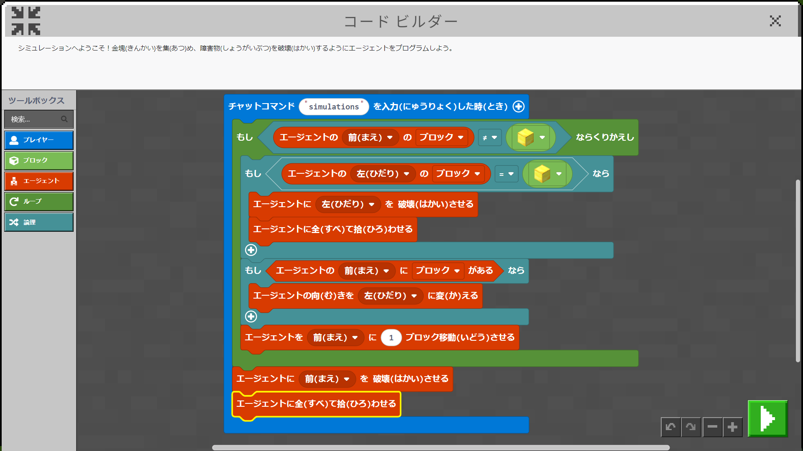

# 02.惑星(わくせい)探索(たんさく)

## 01.宇宙(うちゅう)センター

1. **最初(さいしょ)の材料(ざいりょう)(ざいりょう)を探(さが)す**

	の材料(ざいりょう)を探(さが)す.png "01_最初(さいしょ)の材料(ざいりょう)を探(さが)す")

1. **周辺(しゅうへん)環境(かんきょう)**

	環境(かんきょう).png "02_周辺(しゅうへん)環境(かんきょう)")

1. **渦巻(うずま)き**

	き.png "03_渦巻(うずま)き")

1. **3D 空間(くうかん)**

	.png "04_3D空間(くうかん)")

1. **シミュレーション**

	

# [戻(もど)る](../block02.html)