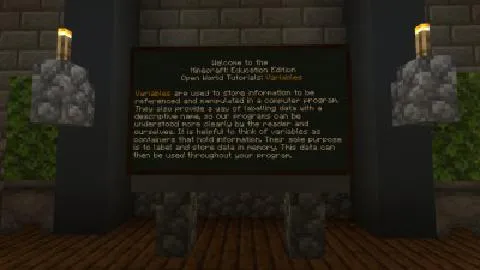
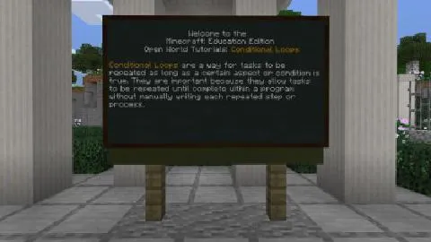

# プログラミングの基本(きほん)と見本(みほん)

- 06-01：順番(じゅんばん)とシーケンス

    

- 06-02：条件(じょうけん)分岐(ぶんき)

    

- 06-03：変数(へんすう)
 
    
 
- 06-04：条件(じょうけん)ループ
    
    
 
- 06-05：回数(かいすう)ループ
 
    
 
- 06-06：関数(かんすう)
 
    
 
- 06-07：イベント処理(しょり)
    
    
 

 # [戻(もど)る](../index.md)